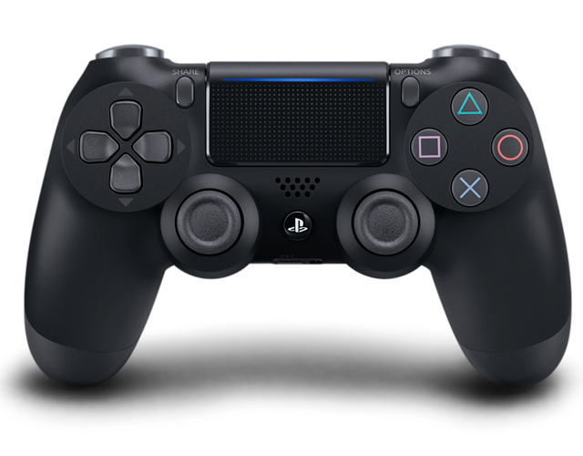

キーコンフィグにより変更可能とする
## メニュー操作について
タイトル画面や装備カスタマイズ画面等UI操作をメインとする場合の操作方法
## アクション操作について
戦闘時等キャラクター操作をメインとする場合の操作方法

# DUALSHOCK4

## メニュー操作
左スティック：カーソル移動  
右スティック：キャラクター右回転／左回転  

十字キー：カーソルの移動  
  
〇：決定  
×：キャンセル  
△：詳細を表示／非表示  
□：ズームイン／ズームアウト  
  
R1：パラメータチップ右回転  
L1：パラメータチップ左回転  

## アクション操作

左スティック：キャラクター移動  
右スティック：カメラ操作  
  
右キー：サブメニューを開く  
上キー：サブメニューカーソル上移動  
下キー：サブメニューカーソル下移動  
左キー：サブメニューを閉じる  
  
〇：決定  
×：ジャンプ  
△：攻撃  
□：攻撃  
  
L1：ガード  
L2：ブースト  
R1：特殊  
R2：特殊  
R3：カメラ位置リセット  
  
オプション：一時停止

# キーボード＋マウス

## メニュー操作

マウス移動：カーソル移動  
左クリック：決定  
右クリック：キャンセル  
  
Qキー：キャラクター左回転  
Eキー：キャラクター右回転  
  
Wキー：詳細を表示／非表示  
Sキー：ズームイン／ズームアウト  
  
Aキー：パラメータチップ右回転  
Dキー：パラメータチップ左回転  

## アクション操作

ASDWキー：キャラクター移動  
マウス移動：カメラ操作  
  
１キー：サブメニューを開く  
２キー：サブメニューカーソル上移動  
３キー：サブメニューカーソル下移動  
４キー：サブメニューを閉じる  
  
Qキー：決定  
スペースキー：ジャンプ  
左クリック：攻撃  
右クリック：攻撃  
  
左シフトキー：ガード  
左コントロールキー：ブースト  
Eキー：特殊  
Rキー：特殊  
Fキー：カメラ位置リセット  
  
Vキー：一時停止

