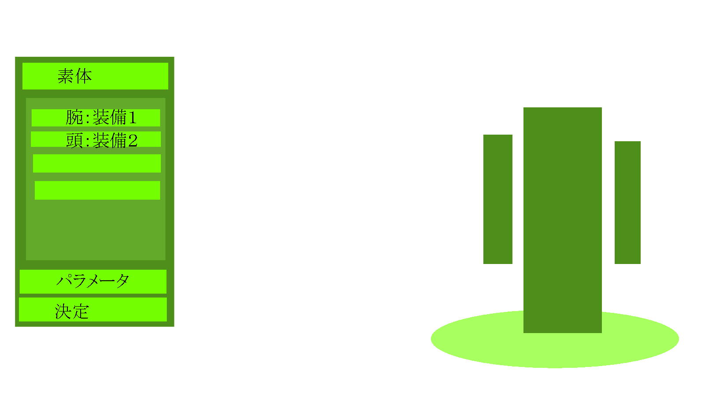
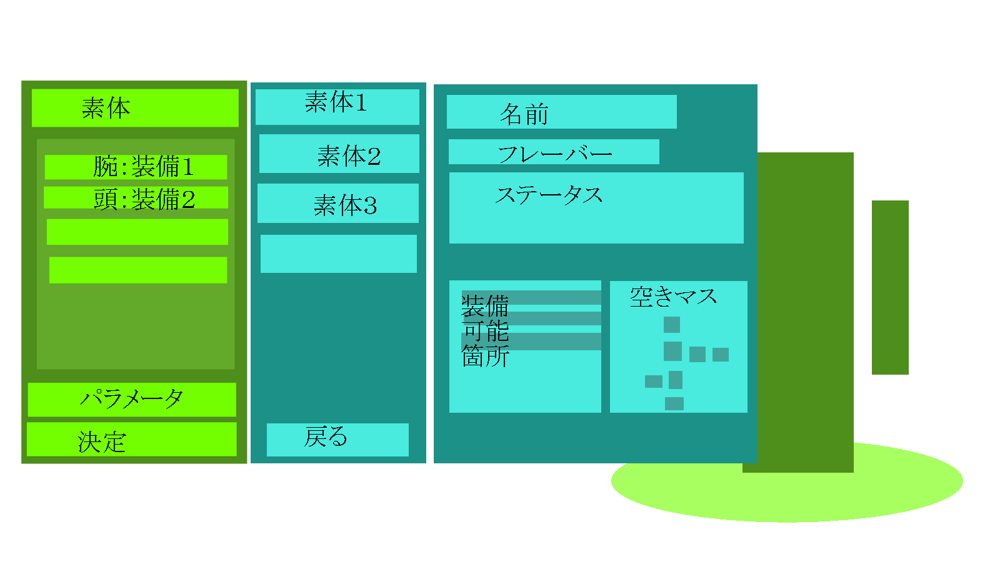
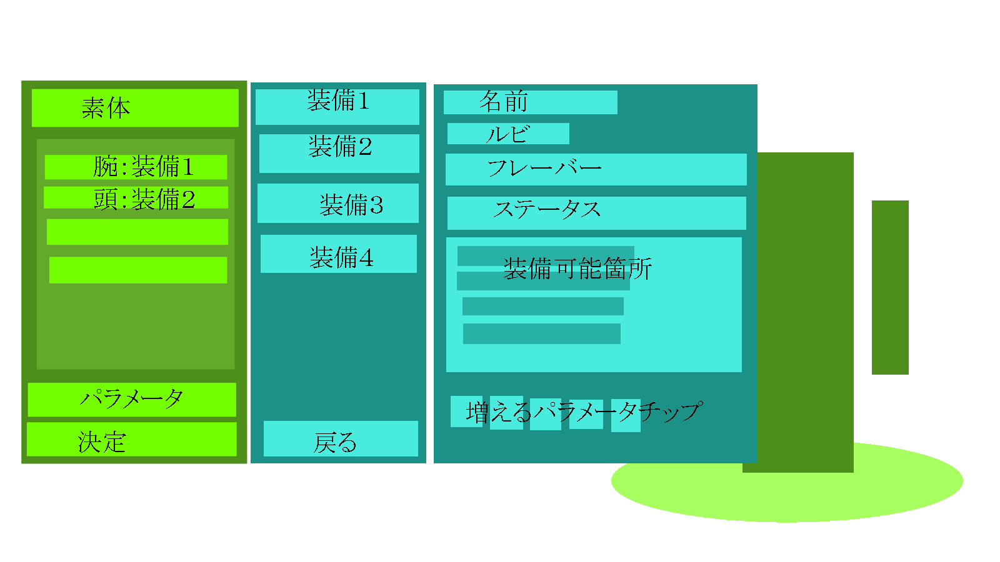
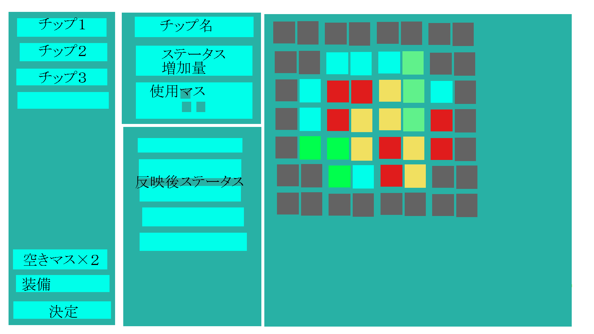

# 装備メインメニュー

* マイセットボタン
* ステータス表示ボタン
* 素体選択ボタン
* 装備選択ボタン
* パラメータカスタマイズボタン
* 決定ボタン
* 反映せずに戻るボタン

## マイセットボタン
マイセット一覧を表示する

## ステータス表示ボタン
ステータスを表示する

## 素体選択ボタン
素体カスタマイズ画面を表示する

## 装備選択ボタン
装備カスタマイズ画面を表示する

## パラメータカスタマイズボタン
パラメータチップカスタマイズ画面を表示する

## 決定ボタン
今の装備で決定する

## 反映せずに戻るボタン
反映させずに前の画面に戻ります　よろしいですか　はい／いいえ

# 素体カスタマイズ画面

* 素体一覧
* 戻るボタン
* 素体ステータス画面

## 素体一覧
* 素体の一覧を表示する
* 素体を選んだらカスタマイズ画面に戻る

## 戻るボタン
* カスタマイズ画面に戻る

## 素体ステータス画面
* 素体のステータスを表示する

# 装備カスタマイズ画面

* 装備一覧
* 戻るボタン
* 装備ステータス画面

## 装備一覧
* 装備の一覧を表示する
* 装備を選んだらカスタマイズ画面に戻る

## 戻るボタン
* カスタマイズ画面に戻る

## 装備ステータス画面
* 装備のステータスを表示する

# パラメータチップカスタマイズ画面

* パラメータチップ一覧
* 空きマス数表示
* カスタマイズ画面に戻るボタン
* 決定ボタン
* 反映せずに戻るボタン
* チップステータス表示画面
* チップ画面
* ステータス表示画面

## パラメータチップ一覧
* 所持しているパラメータチップを表示する

## 空きマス表示画面
* 増やせられる空きマスを表示する

## カスタマイズ画面に戻るボタン
* カスタマイズ画面に戻る

## 決定ボタン
* 決定する

## 反映せずに戻るボタン
* 反映せずに戻る

## チップステータス表示画面
* 選択中のチップのステータスを表示する

## チップ画面
* チップのカスタマイズをする

## ステータス表示画面
* 現在のステータスを表示する

# ステータス表示画面
* 表示／非表示を切り替えられる
* 現在のステータスを表示する

# マイセット画面
* 登録ボタン
* マイセット一覧

## 登録ボタン
* 現在の装備とパラメータチップを名前を付けて保存できる

## マイセット一覧
* 登録済みのマイセットを表示する
* マイセットを選択することでマイセットにカスタマイズする

