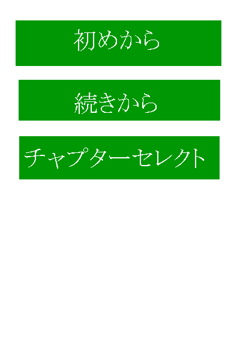
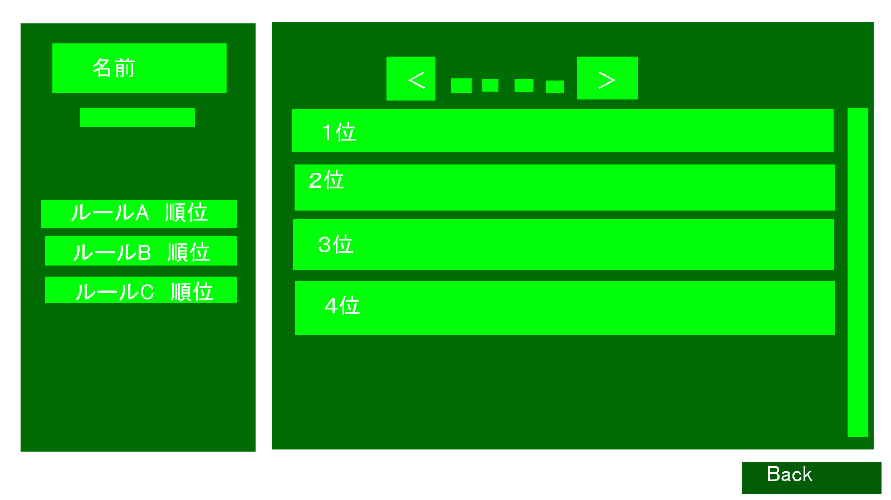

# メニュー画面までのフロー
## クレジット表示

※クレジットはあれば出す
* 黒背景からクレジットだけフェードインしてくる
* ちょっと待ってフェードアウトする
* ボタン押すと早く表示されて、早く消える

## ロードっぽいの表示

* 左下にいくつもロードっぽい文字羅列が出てくる
* 下からせりあがってくる感じ
* 100%ばっかりでどれも順調そうに見える

## エラーがたくさん出てくる

* 途中から失敗しまくる
* 画面がエラーログで真っ赤になる

## 画面にヒビ入る

## 血っぽい液体流れてくる

* 背景明るくなる←起動したっぽい感じ
* ヒビの間から「ツーッ」って感じ

## タイトル出てくる

* タイトル出てくる
* タイトルロゴもヒビ割れでゆがんでほしい

## 演出始まる

* 画面の後ろでいくつもムービーが始まる
  * シナリオの動画
  * プレイ動画
* PPAKの文字が点滅する

## メインメニュー表示

* 血が戻って、ヒビが直る←巻き戻しみたいな感じ
* メニューウィンドウが出てくる
* メニューを選択するたびに左側に選んだ項目がストックされる←パンくずリスト
* メニューのヘッダ以外が閉じて、差し込まれる感じ
* 差し込まれた後、場所調節

# メニュー遷移

## メインメニュー

* Single Play
* Multi Play
* Gallery
* Ranking
* Option
* Exit

### Single Play
一人プレイで始める  
一人プレイモード選択メニューへ遷移

### Multi Play
オンライン対戦する
マルチプレイモード選択画面へ遷移

### Gallery
一人プレイ時のシナリオが確認できる  
Galleryメニューへ遷移

### Ranking
オンライン対戦のレート等が確認できる  
Rankingメニューへ遷移

### Option
キーコンフィグ等が設定できる  
Optionメニューへ遷移

### Exit
ゲームを終了する

## 一人プレイモード選択メニュー

* 初めから
* 続きから
* チャプターセレクト

### 初めから
シナリオをはじめから始める  
メインゲームへ遷移  

### 続きから
シナリオを続きから始める
メインゲームへ遷移  
セーブデータがないときは選択できない  
セーブデータがあるときは初期選択項目にする

### チャプターセレクト
シナリオを好きなところから始められる
チャプターセレクトメニューへ遷移

## チャプターセレクトメニュー

* 一度見たことがあるチャプターと同じカテゴリのチャプターがすべて表示される
* シナリオの時系列順に表示される
* シナリオ順に表示される
* シナリオの詳細が見れる
* シナリオのサムネが見れる

## Galleryメニュー

* 表示できるカテゴリのスクロール
* カテゴリ内の表示できるフェーズのサムネとタイトル
* 戻るボタン

## Rankingメニュー

* 自分のランキング
* ルール毎のランキング
* LRとかキー入力とかでルール切り替え
* 1000位まで見れる
* 戻るボタン

## Optionメニュー

* 各項目について左右キーで選択する
* キーコンフィグはプルダウンで選ぶ
* 保存が押された時点で反映される

